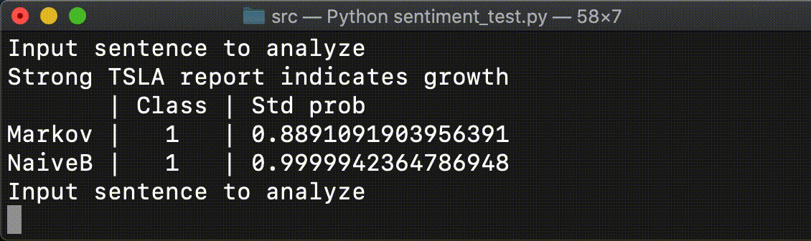

# Sentiment Analysis
### A sentiment analysis API, designed to 
* Be extensible 
* Allow for the consumption of data from many different kinds of sources
* Provide estimates from multiple kinds of NLP models
### General info
* Supports Naive Bayes, Markov Chain, BERT models
* Sentiment is classified as either positive (1) or negative (0)
* Model relative probability of sentiment estimate is provided as well (second argument of return Tuple)
### Runbook

* Run `python3 sentiment_test.py` in `src` directory for interactive console analysis
* Current implementation relies on a CSV of sample Twitter data
* To hook up a new training data source, implement the `TrainingDataSource` interface
* Similarly, implement the `LiveDataSource` interface to allow for estimates to be based on live data. Note: example implementations will usually required auth, so you will need to add your credentials before running. 
* See `sentiment_test.py` for an example of how to build models from the `TrainingDataSource`